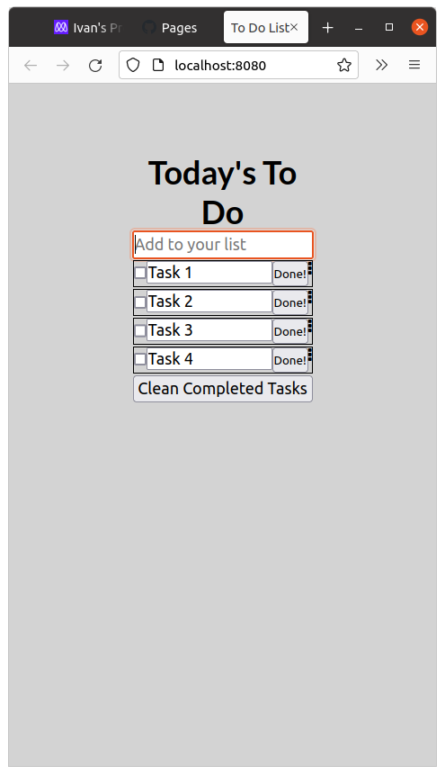

# To-do List

> Solo programming project for week one of module 2 of the Microverse Program.

<!-- 
 -->

"To-do List" is a simple website that displays a list of books and allows you to add and remove books from that list.

## Live Page

[Page Link](https://ikuartz.github.io/to-do-list/dist/index.html)
### First requirements:

    Set up a new project with webpack that is based on the webpack exercise you have already completed.
    Create an index.html file and write your HTML markup here. Create an empty To Do List placeholder (
 or <ul> element). The index.html file must be set as a template using the HTML Webpack Plugin.
    Create an index.js file and set an array of some simple to do tasks (array of objects). Each task object should contain three keys:
        description [string].
        completed [bool].
        index: [number].
    Write a function to iterate over the tasks array and populate an HTML list item element for each task.
    On page load render the dynamically created list of tasks in the dedicated placeholder. The list should appear in order of the index values for each task.
    Create a style.css and set rules for the To Do List. CSS must be loaded by Webpack Style/CSS Loader. Your list should be a clone of the part of the minimalist project captured in the video provided by Microverse.

    All your source files (index.html, index.js and style.css) must be located in /src directory and your distribution files will be generated by webpack and served by webpack dev server from /dist folder.

### Second requirements:

    Add a new JavaScript file and import it as a module:
        it will contain methods related to the status updates (completed: true / false).
    Add event listener to the checkbox (change).
    Update items object's value for completed key upon user actions.
    Implement a function for the "Clear all completed" button (use filter() method).
    Store the updated array of items in local storage, so the user gets the correct list values after the page reloads.

> To setup the project on your machine:

## Getting Started

Clone the repository and setup the linters

## Prerequisites

- npm ( Node Package Manager )
- git and Github Account

### Setup

To get a local copy up and running follow these simple example steps.

- Open terminal
- Change the directory you want put the repo
- Then run
  i. Run git clone git@github.com:mengiefen/awesome-books.git
  ii. cd repo-name/

### Install

- **Webhint** linter

  `npm install --save-dev hint@6.x`

- **Stylelint** linter

  `npm install --save-dev stylelint@13.x stylelint-scss@3.x stylelint-config-standard@21.x stylelint-csstree-validator@1.x`

- **ESLint** linter

  `npm install --save-dev eslint@7.x eslint-config-airbnb-base@14.x eslint-plugin-import@2.x babel-eslint@10.x`

### Run tests

- **Webhint** linter -`npx hint .` on the root of your directory of your project.
- **Stylelint** linter
  - `npx stylelint "**/*.{css,scss}"` on the root of your directory of your project.
- **ESLint** linter
  - `npx eslint .` on the root of your directory of your project.

## Built With

- HTML
- CSS
- Javascript
- Love

## Live Demo

[Live Demo Link](https://ikuartz.github.io/to-do-list/)

## Author

👤 **Ivan Silva**

- GitHub: [@iKuartz](https://github.com/iKuartz/)
- Twitter: [@iKuartz01](https://twitter.com/iKuartz01)
- LinkedIn: [Ivan Silva](https://www.linkedin.com/in/ivan-silva-a47058b3/)

## 🤝 Contributing

Contributions, issues, and feature requests are welcome!

Feel free to check the [issues page](https://github.com/iKuartz/to-do-list/issues).

## Show your support

Give a ⭐️ if you like this project!

## Acknowledgments

- A big thank you to Microverse, for providing me the knowledge and tools to finish this project.
- An even bigger thank you to all my coding partners who helped me get here.

## 📝 License

## Attribution-NonCommercial 4.0 International (CC BY-NC 4.0)

Disclaimer: This is a human-readable summary of (and not a substitute for) the [license](https://creativecommons.org/licenses/by-nc/4.0/legalcode).

You are free to:

    Share — copy and redistribute the material in any medium or format
    Adapt — remix, transform, and build upon the material

    The licensor cannot revoke these freedoms as long as you follow the license terms.

Under the following terms:

    Attribution — You must give appropriate credit, provide a link to the license, and indicate if changes were made. You may do so in any reasonable manner, but not in any way that suggests the licensor endorses you or your use.

    NonCommercial — You may not use the material for commercial purposes.

    No additional restrictions — You may not apply legal terms or technological measures that legally restrict others from doing anything the license permits.

Notices:

    You do not have to comply with the license for elements of the material in the public domain or where your use is permitted by an applicable exception or limitation.
    No warranties are given. The license may not give you all of the permissions necessary for your intended use. For example, other rights such as publicity, privacy, or moral rights may limit how you use the material.
